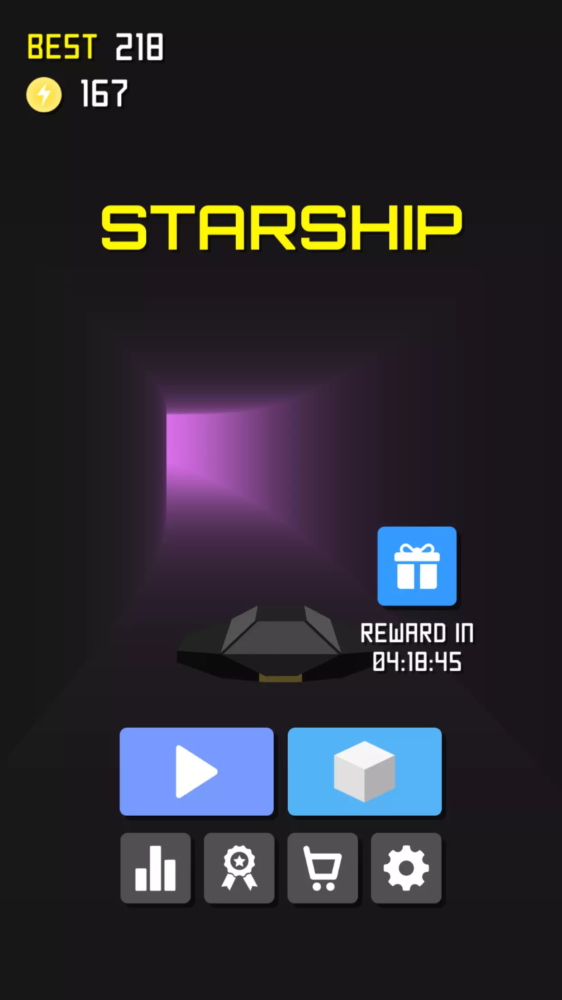
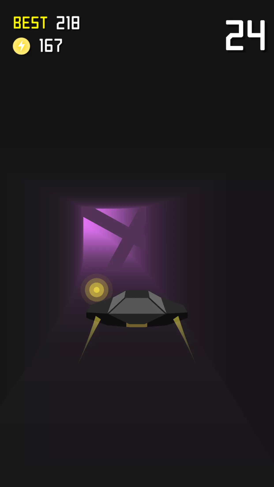
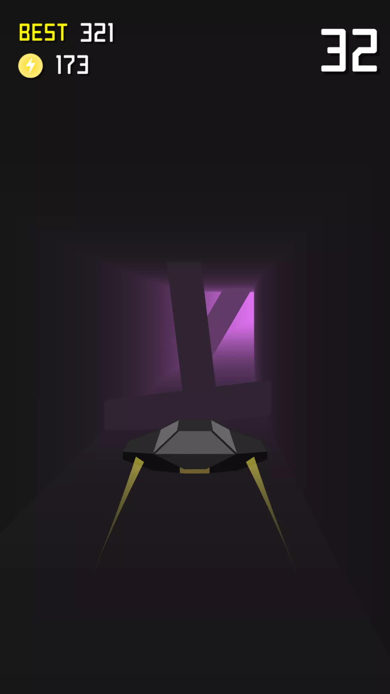
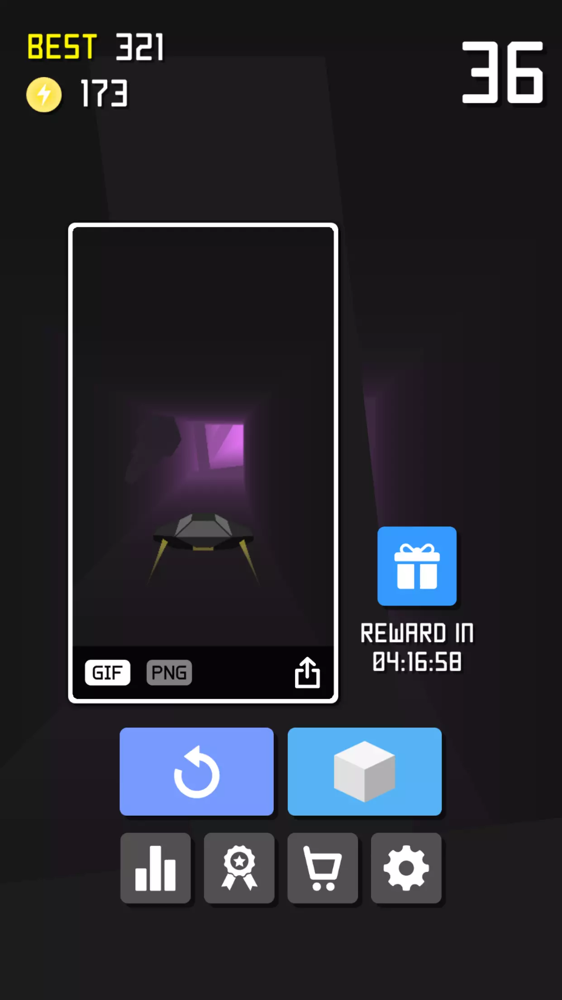
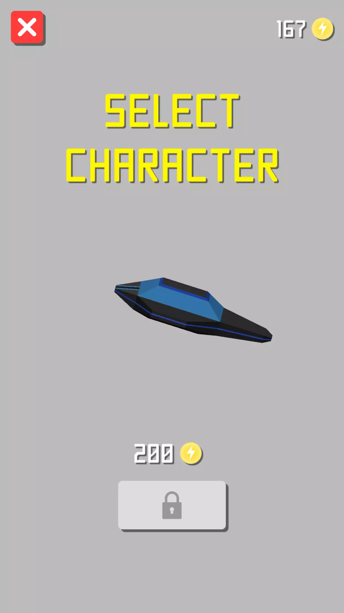
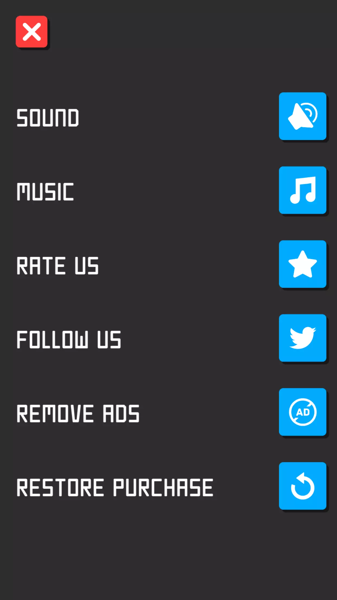

# Starship

  
  
  
  
  
  

## Documentation
  Drag to control the spaceship to avoid deadly obstacles on an adventurous journey! Survive as long as you can and don't forget to collect coins to unlock awesome ships! Starship is a thrilling casual game that is suitable for people of all ages!

## HIGHLIGHTS:
  * Addictive one-touch gameplay suitable for everyone.
  * 30 built-in spaceship models for unlocking.
  * Daily reward system for better retention.
  * Easy to customize.
  * Assets (sounds, fonts, models, sprites, etc.) are free for commercial use.
  * Optimized for iOS & Android.

## PREMIUM FEATURES:
  * Compatible with AdColony, AdMob, Chartboost, Facebook Audience Network, Heyzap, ironSource, MoPub, Tapjoy and Unity Ads: just import the SDKs you want to use!
  * In-app purchasing (buying coins, removing ads)
  * Leaderboard and Achievements
  * Recording gameplay in realtime and then exporting GIF images for sharing
  * Sharing screenshots to social networks
  * Native rating popup (rate my app)
  * Push notification using OneSignal or Firebase service
  * Native alerts

